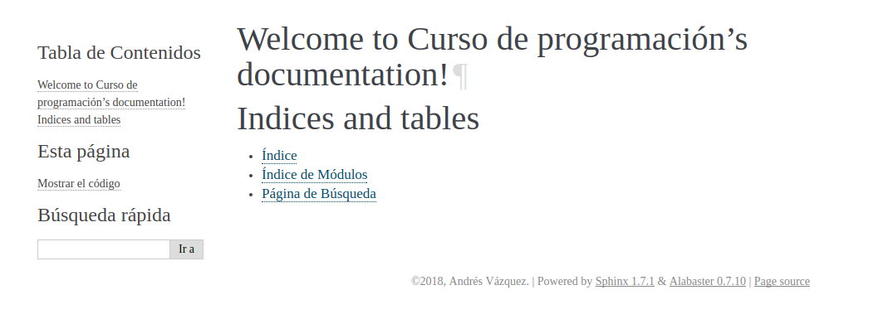
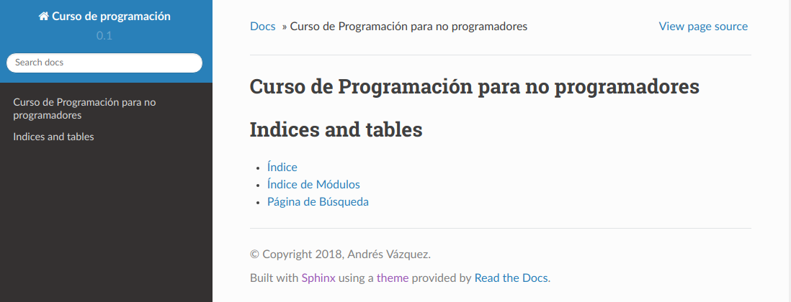

# Crear este manual

Este manual es creado con [Sphinx](http://www.sphinx-doc.org/es/master/).  

Los pasos a seguir para replicar este proceso son:

## Instalar Sphinx 
En Ubuntu (o más info [acá](http://www.sphinx-doc.org/en/master/usage/installation.html)).  

```
apt-get install python3-sphinx
pip install sphinx
```

## Inicializar la documentación 

```
sphinx-quickstart
```

Detalles:
 - Separar la carpeta build (compilación final de la documentación) para que no quede en _build dentro de _source_.
 - Si va a publicarse en _GitHub pages_ aceptar la creación del archivo _.nojekyll_.
 - Prestar atención a todas las opciones (salida epub, autodoc, doctest, etc).

## Compilando

Para usar la utilidad de Github Pages de publicar el dicrectorio docs lo creo y compilo apuntando como destino este directorio.  

```
sphinx-build -b html source docs
```

Subido ya se ve así:


## Usando un template

El _template_ inicial no es muy atractivo. Instalo el template

```
pip install sphinx_rtd_theme
```


